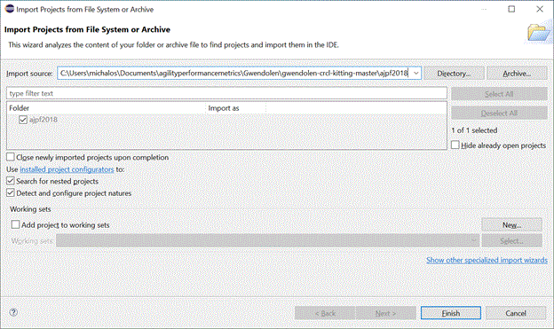
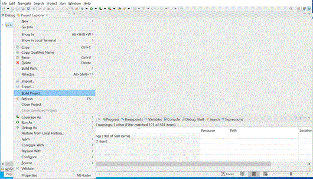
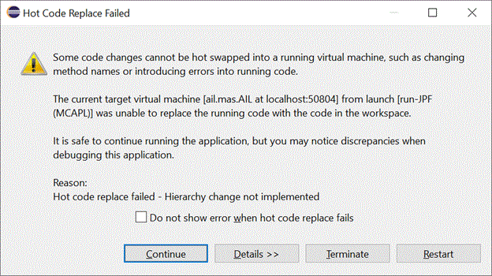
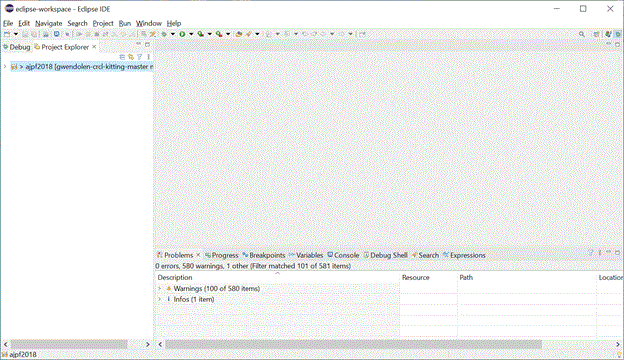
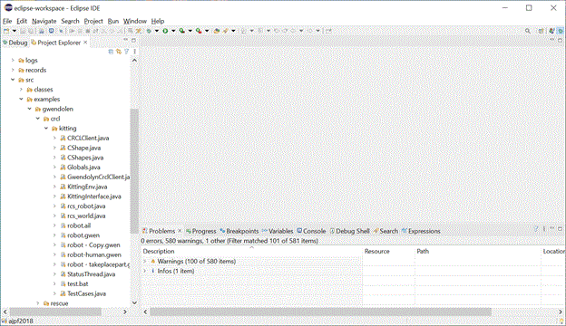
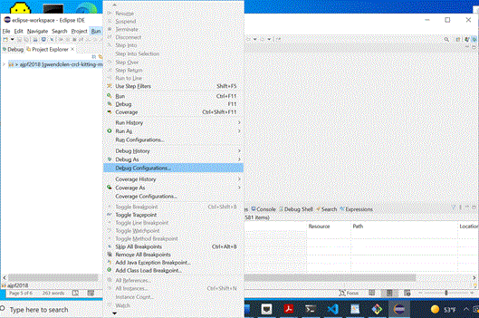
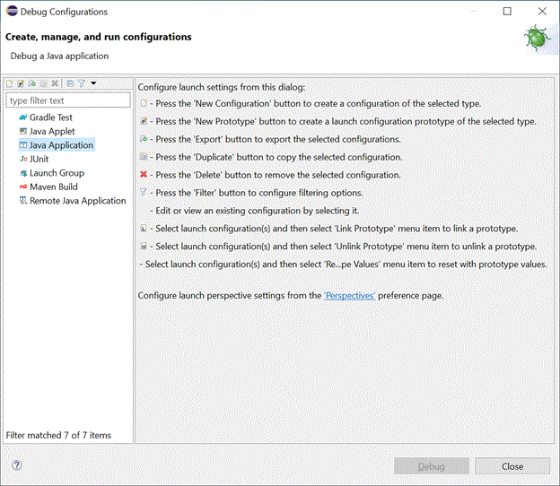
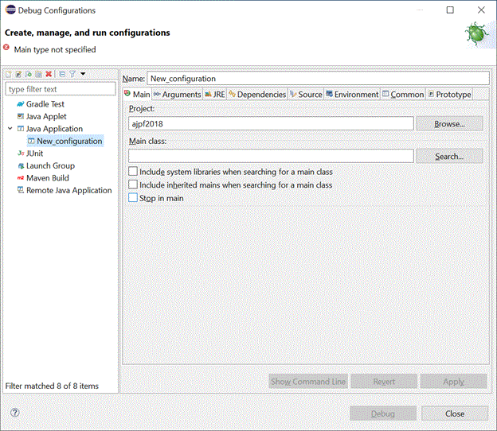
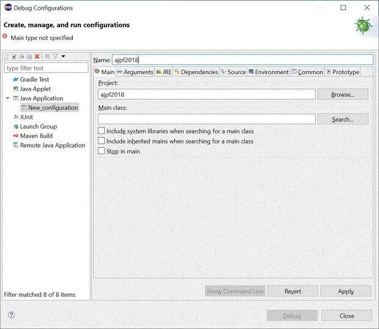
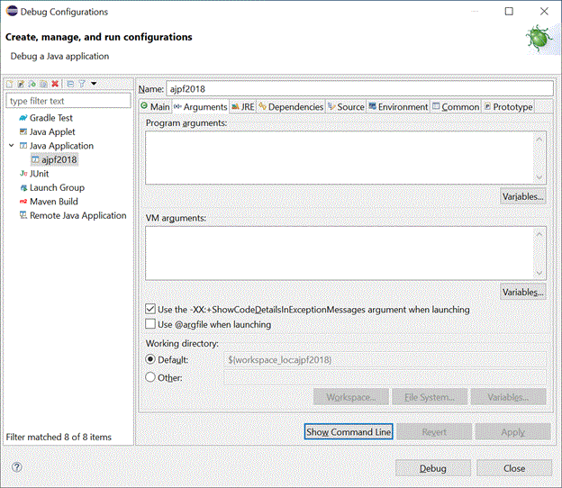

# gwendolen-crcl-kitting
----



Note, these instructions are for compiling the simulated CRCL loopback test with the Gwendolen kitting crcl program on a WINDOWS 10 machine. If you follow these instructions the necessary 3rd party and CRCL jar files should already be included in the clone (you won't need to build the jars). 

Gwendolen code for a simulation of a kitting problem, using an interface with CRCL.

## Install Eclipse, Launch

This is the version of Eclipse used in the following instructions:

Eclipse IDE for Java Developers (includes Incubating components)

Version: 2021-09 (4.21.0)

Build id: 20210910-1417

## Clone the repository

Clone the master branch of the gwendolen-crcl-kitting repository  found at [<u>here</u>](https://github.com/autonomy-and-verification/gwendolen-crcl-kitting)  

	git clone https://github.com/autonomy-and-verification/gwendolen-crcl-kitting.git 

This will create a folder gwendolen-crcl-kitting-master and copy in the contents of the Java Eclipse project containing JPF, AIL and the GWENDOLEN CRCL KITTING projects.

The groundzero branch contains the basic Gwendolen and kitting code.

## Open eclipse project 

File -> Open Project  and then Click directory, and enter clone folder: gwendolen-crcl-kitting-master\ajpf2018

Below my Import Source folder was C:\Users\michalos\Documents\agilityperformancemetrics\Gwendolen\gwendolen-crcl-kitting-master\ajpf2018

Click FINISH.

## CLEAN&BUILD

In Eclipse there is an "Auto Build" option, which is checked by default. When it is checked, you don't need to build your project, this happens automatically. If this behavior is unwanted, uncheck this option and click build project whenever you want.

To clean a project, select Clean Project. This will delete the bin folder, however if Auto build is checked, it will be immediately regenerated.

Project -> (Turn off Build Automatically) and Then Build All (no errors)



If you have any Java compiler errors they will appear in the "PROBLEMS" tab shown below. As the screen shot shows, out of the box, there are numerous warnings while compiling the ajpf2018 project.



## RUN/DEBUG:

The Gwendolen CRCL Kitting code is located under the C:\...\gwendolen-crcl-kitting-master\ajpf2018\src\examples\gwendolen\crcl\kitting folder. 

You will need to edit the C:\...\gwendolen-crcl-kitting-master\ajpf2018\src\examples\gwendolen\crcl\kitting\robot.ail file.

You will need to  configure the mas.file to point to the Gwendolen CRCL/Kitting robot.gwen file where you installed

mas.file = C:\\...\\ajpf2018\\src\\examples\\gwendolen\\crcl\\kitting\\robot.gwen

Note the use of the double backspace to signify a folder, this is required for the Java program to parse the Windows file path.

This is how it look in the robot.ail file below:

	mas.file = C:\\...\\ajpf2018\\src\\examples\\gwendolen\\crcl\\kitting\\robot.gwen 
	mas.builder = gwendolen.GwendolenMASBuilder 
	 
	env = gwendolen.crcl.kitting.KittingEnv 
	 
	log.info = ail.mas.DefaultEnvironment 
	log.fine = ail.semantics.operationalrules 
	log.warning = ajpf.MCAPLAgent 
	log.format = brief 

The Gwendelen CRCL kitting Java source is shown in Windows file explorer below. This information is important to know if you want to set a breakpoint in the file executable during debugging.

We are only describing the Debug Configuration, as we only debugged the Gwendolen CRCL-Kitting agility tests. First click on the menu bar: Run -> Debug Configuration

You should then see:

Next, double click on Java Application:

Then enter **ail.mas.AIL** into the main class. **CLICK APPLY** 

Now switch to the Arguments Tab. 

**Program Arguments** C:\...\ajpf2018\src\examples\gwendolen\crcl\kitting\robot.ail -log -buildinfo

**VM Arguments:** -Xmx10000m -ea

**Click APPLY.**

****

**You should see the following output in the Console Window (if not visible enable by Window->Show View->Console and it should appear at the bottom.**

	crcl[INFO|main|4:22:54]: INITIAL KTTING WORLD 
	sku_kit_m2l1_vessel14 at [ 0.4000, -1.0500,  0.9200 ] 
		slot1 sku_part_medium_gear (empty) at [ 0.4564,-1.0120, 0.9200] 
		slot2 sku_part_medium_gear (empty) at [ 0.4535,-1.0920, 0.9200] 
		slot3 sku_part_large_gear (empty) at [ 0.3600,-1.0485, 0.9200] 
	sku_kit_m2l1_vessel15 at [ 0.1800, -1.0500,  0.9200 ] 
		slot1 sku_part_medium_gear (empty) at [ 0.2364,-1.0120, 0.9200] 
		slot2 sku_part_medium_gear (empty) at [ 0.2335,-1.0920, 0.9200] 
		slot3 sku_part_large_gear (empty) at [ 0.1400,-1.0485, 0.9200] 
	sku_medium_gear_vessel16 at [ 0.1900, -1.2400,  0.9200 ] 
		slot1 sku_part_medium_gear (sku_part_medium_gear17) at [ 0.2282,-1.1991, 0.9200] 
		slot2 sku_part_medium_gear (sku_part_medium_gear18) at [ 0.1491,-1.2018, 0.9200] 
		slot3 sku_part_medium_gear (sku_part_medium_gear20) at [ 0.2309,-1.2782, 0.9200] 
		slot4 sku_part_medium_gear (sku_part_medium_gear19) at [ 0.1518,-1.2809, 0.9200] 
	sku_large_gear_vessel21 at [ 0.3900, -1.2600,  0.9200 ] 
		slot1 sku_part_large_gear (sku_part_large_gear23) at [ 0.3922,-1.3150, 0.9200] 
		slot2 sku_part_large_gear (sku_part_large_gear22) at [ 0.3878,-1.2050, 0.9200] 
	  
	Environment started. 
	gwen[INFO|main|4:22:54]: START GWENDOLEN TRACE 
	  
	Environment is simulating action: trace 
	gwen[INFO|main|4:22:54]: new_tray  
	ail.mas.DefaultEnvironment[INFO|main|4:22:54]: lrmate done trace(new_tray)  
	ail.semantics.operationalrules[FINE|main|4:22:54]: lrmate added action_result(false)[source(percept)]  
	gwen[INFO|main|4:22:54]: 	find_slot(null)  
	Environment is simulating action: find_slot 
	ail.mas.DefaultEnvironment[INFO|main|4:22:54]: lrmate done find_slot([slot(sku_kit_m2l1_vessel14.slot1,medium,empty),slot(sku_kit_m2l1_vessel14.slot2,medium,empty),slot(sku_kit_m2l1_vessel14.slot3,large,empty),])  
	ail.semantics.operationalrules.Perceive[FINE|main|4:22:54]: lrmate incoming percept slot(sku_kit_m2l1_vessel14.slot3,large,empty)  
	ail.semantics.operationalrules.Perceive[FINE|main|4:22:54]: lrmate incoming percept slot(sku_kit_m2l1_vessel14.slot2,medium,empty)  
	ail.semantics.operationalrules.Perceive[FINE|main|4:22:54]: lrmate incoming percept slot(sku_kit_m2l1_vessel14.slot1,medium,empty)  
	ail.semantics.operationalrules[FINE|main|4:22:54]: lrmate added slot(sku_kit_m2l1_vessel14.slot3,large,empty)[source(percept)]  
	ail.semantics.operationalrules[FINE|main|4:22:54]: lrmate added slot(sku_kit_m2l1_vessel14.slot2,medium,empty)[source(percept)]  
	ail.semantics.operationalrules[FINE|main|4:22:54]: lrmate added slot(sku_kit_m2l1_vessel14.slot1,medium,empty)[source(percept)]  
	ail.semantics.operationalrules[FINE|main|4:22:54]: lrmate dropped kit_tray(sku_kit_m2l1_vessel14,[slot(sku_kit_m2l1_vessel14.slot1,medium,empty),slot(sku_kit_m2l1_vessel14.slot2,medium,empty),slot(sku_kit_m2l1_vessel14.slot3,large,empty),])[source(self)]  
	Environment is simulating action: trace 
	gwen[INFO|main|4:22:54]: slot Id SizeSlot Slot   
	ail.mas.DefaultEnvironment[INFO|main|4:22:54]: lrmate done trace(slot Id SizeSlot Slot )  
	Environment is simulating action: trace 
	gwen[INFO|main|4:22:54]: slot Id SizeSlot Slot   
	ail.mas.DefaultEnvironment[INFO|main|4:22:54]: lrmate done trace(slot Id SizeSlot Slot )  
	Environment is simulating action: trace 
	gwen[INFO|main|4:22:54]: slot Id SizeSlot Slot   
	ail.mas.DefaultEnvironment[INFO|main|4:22:54]: lrmate done trace(slot Id SizeSlot Slot )  
	ail.semantics.operationalrules[FINE|main|4:22:54]: lrmate added slot_active(sku_kit_m2l1_vessel14.slot3,large,empty)[source(self)]  
	ail.semantics.operationalrules[FINE|main|4:22:54]: lrmate added slot_active(sku_kit_m2l1_vessel14.slot2,medium,empty)[source(self)]  
	ail.semantics.operationalrules[FINE|main|4:22:54]: lrmate added slot_active(sku_kit_m2l1_vessel14.slot1,medium,empty)[source(self)]  
	Environment is simulating action: trace 
	gwen[INFO|main|4:22:54]: loop perform  
	ail.mas.DefaultEnvironment[INFO|main|4:22:54]: lrmate done trace(loop perform)  
	ail.semantics.operationalrules[FINE|main|4:22:54]: lrmate dropped slot_active(sku_kit_m2l1_vessel14.slot1,medium,empty)[source(self)]  
	Environment is simulating action: trace 
	gwen[INFO|main|4:22:54]: kitting  
	ail.mas.DefaultEnvironment[INFO|main|4:22:54]: lrmate done trace(kitting)  
	Environment is simulating action: find_gear 
	gwen[INFO|main|4:22:54]: 	find_gear(null)  
	ail.mas.DefaultEnvironment[INFO|main|4:22:54]: lrmate done find_gear([sku_part_medium_gear17,sku_part_medium_gear18,sku_part_medium_gear19,sku_part_medium_gear20,])  
	ail.semantics.operationalrules.Perceive[FINE|main|4:22:54]: lrmate incoming percept gear(sku_part_medium_gear17)  
	ail.semantics.operationalrules[FINE|main|4:22:54]: lrmate added gear(sku_part_medium_gear17)[source(percept)]  
	Environment is simulating action: trace 
	gwen[INFO|main|4:22:54]: take_part  
	ail.mas.DefaultEnvironment[INFO|main|4:22:54]: lrmate done trace(take_part)  
	gwen[INFO|main|4:22:54]: 	take_part(sku_part_medium_gear17)  
	Environment is simulating action: take_part 
	Action: take_part location=sku_part_medium_gear17 
	trace[INFO|main|4:22:54]: moveto gearsku_part_medium_gear17  
	crcl[INFO|main|4:22:54]: pickupGear=sku_part_medium_gear17 approach/move/close/retract  
	trace[INFO|main|4:22:54]: world gear    pose 0.2300, -1.2000,  0.9200 -0.0110, -0.0030,  0.0220,  0.9997,   
	trace[INFO|main|4:22:54]: world base    pose-0.1690, -1.1400,  0.9342  0.0000,  0.0000,  0.0000,  1.0000,   
	trace[INFO|main|4:22:54]: world baseinv pose 0.1690,  1.1400, -0.9342 -0.0000, -0.0000, -0.0000,  1.0000,   
	trace[INFO|main|4:22:54]: robot gear pose 0.3990, -0.0600, -0.0142 -0.0110, -0.0030,  0.0220,  0.9997,   
	trace[INFO|main|4:22:54]: pickpose 0.3990, -0.0600,  0.0008  0.7071,  0.7071,  0.0000,  0.0000,   
	crcl[INFO|main|4:22:54]: class crcl.base.MoveToType 0.3990, -0.0600,  0.0408  0.7071,  0.7071,  0.0000,  0.0000,   
	crcl[INFO|main|4:22:56]: class crcl.base.MoveToType 0.3990, -0.0600,  0.0008  0.7071,  0.7071,  0.0000,  0.0000,   
	crcl[INFO|main|4:22:58]: class crcl.base.SetEndEffectorType close  
	trace[INFO|main|4:22:58]: Closest gear location= 0.3990, -0.0600,  0.0008  0.7071,  0.7071,  0.0000,  0.0000,   
	trace[INFO|main|4:22:58]: Gear sku_part_medium_gear17location= 0.3990, -0.0600, -0.0142 -0.0110, -0.0030,  0.0220,  0.9997,   
	trace[INFO|main|4:22:58]: Closest Gear to commanded locationsku_part_medium_gear17  
	crcl[INFO|main|4:23:00]: class crcl.base.MoveToType 0.3990, -0.0600,  0.0408  0.7071,  0.7071,  0.0000,  0.0000,   
	ail.mas.DefaultEnvironment[INFO|main|4:23:02]: lrmate done take_part(sku_part_medium_gear17)  
	ail.semantics.operationalrules.Perceive[FINE|main|4:23:02]: lrmate incoming percept action_result(true)  
	ail.semantics.operationalrules[FINE|main|4:23:02]: lrmate dropped action_result(false)[source(percept)]  
	ail.semantics.operationalrules[FINE|main|4:23:02]: lrmate added action_result(true)[source(percept)]  
	ail.semantics.operationalrules[FINE|main|4:23:02]: lrmate dropped action_result(true)[source(percept)]  
	Environment is simulating action: trace 
	gwen[INFO|main|4:23:02]: check_action_result_take_part T  
	ail.mas.DefaultEnvironment[INFO|main|4:23:02]: lrmate done trace(check_action_result_take_part T)  
	ail.semantics.operationalrules.Perceive[FINE|main|4:23:02]: lrmate incoming percept action_result(false)  
	ail.semantics.operationalrules[FINE|main|4:23:02]: lrmate added action_result(false)[source(percept)]  
	ail.semantics.operationalrules[FINE|main|4:23:02]: lrmate dropped gripper(open)[source(self)]  
	ail.semantics.operationalrules[FINE|main|4:23:02]: lrmate added gripper(close)[source(self)]  
	ail.semantics.operationalrules[FINE|main|4:23:02]: lrmate added grasped(Gear0)[source(self)]  
	Environment is simulating action: trace 
	gwen[INFO|main|4:23:02]: place_part  
	ail.mas.DefaultEnvironment[INFO|main|4:23:02]: lrmate done trace(place_part)  
	gwen[INFO|main|4:23:02]: 	place_part(sku_kit_m2l1_vessel14.slot1)  
	Environment is simulating action: place_part 
	Action: place_part location=sku_kit_m2l1_vessel14.slot1 
	trace[INFO|main|4:23:02]: move gear to kit sku_kit_m2l1_vessel14 slot=slot1  
	crcl[INFO|main|4:23:02]: placeGear kit=sku_kit_m2l1_vessel14 slot= slot1  approach/move/open/retract  
	trace[INFO|main|4:23:02]: kitloc 0.4000, -1.0500,  0.9200  0.0000,  0.0000, -0.7200,  0.6940,   
	trace[INFO|main|4:23:02]: slotloc 0.4564, -1.0120,  0.9200  0.0000,  0.0000,  0.0000,  1.0000,   
	trace[INFO|main|4:23:02]: slotpose 0.6254,  0.1280, -0.0142  0.0000,  0.0000,  0.0000,  1.0000,   
	trace[INFO|main|4:23:02]: slotoffset 0.0000,  0.0000, -0.0350  0.0000,  0.0000,  0.0000,  1.0000,   
	trace[INFO|main|4:23:02]: placepose 0.6254,  0.1280,  0.0208  0.7071,  0.7071,  0.0000,  0.0000,   
	crcl[INFO|main|4:23:02]: class crcl.base.MoveToType 0.6254,  0.1280,  0.0608  0.7071,  0.7071,  0.0000,  0.0000,   
	crcl[INFO|main|4:23:04]: class crcl.base.MoveToType 0.6254,  0.1280,  0.0208  0.7071,  0.7071,  0.0000,  0.0000,   
	crcl[INFO|main|4:23:06]: class crcl.base.SetEndEffectorType open  
	crcl[INFO|main|4:23:06]: release gear sku_part_medium_gear17 to new location 0.4564, -1.0120,  0.9200  0.0000,  0.0000,  0.0000,  1.0000,   
	crcl[INFO|main|4:23:06]: New kitting scene inferences after gear move 
	sku_kit_m2l1_vessel14 at [ 0.4000, -1.0500,  0.9200 ] 
		slot1 sku_part_medium_gear (sku_part_medium_gear17) at [ 0.4564,-1.0120, 0.9200] 
		slot2 sku_part_medium_gear (empty) at [ 0.4535,-1.0920, 0.9200] 
		slot3 sku_part_large_gear (empty) at [ 0.3600,-1.0485, 0.9200] 
	sku_kit_m2l1_vessel15 at [ 0.1800, -1.0500,  0.9200 ] 
		slot1 sku_part_medium_gear (empty) at [ 0.2364,-1.0120, 0.9200] 
		slot2 sku_part_medium_gear (empty) at [ 0.2335,-1.0920, 0.9200] 
		slot3 sku_part_large_gear (empty) at [ 0.1400,-1.0485, 0.9200] 
	sku_medium_gear_vessel16 at [ 0.1900, -1.2400,  0.9200 ] 
		slot1 sku_part_medium_gear (empty) at [ 0.2282,-1.1991, 0.9200] 
		slot2 sku_part_medium_gear (sku_part_medium_gear18) at [ 0.1491,-1.2018, 0.9200] 
		slot3 sku_part_medium_gear (sku_part_medium_gear20) at [ 0.2309,-1.2782, 0.9200] 
		slot4 sku_part_medium_gear (sku_part_medium_gear19) at [ 0.1518,-1.2809, 0.9200] 
	sku_large_gear_vessel21 at [ 0.3900, -1.2600,  0.9200 ] 
		slot1 sku_part_large_gear (sku_part_large_gear23) at [ 0.3922,-1.3150, 0.9200] 
		slot2 sku_part_large_gear (sku_part_large_gear22) at [ 0.3878,-1.2050, 0.9200] 
	  
	crcl[INFO|main|4:23:08]: class crcl.base.MoveToType 0.6254,  0.1280,  0.0608  0.7071,  0.7071,  0.0000,  0.0000,   
	ail.mas.DefaultEnvironment[INFO|main|4:23:11]: lrmate done place_part(sku_kit_m2l1_vessel14.slot1)  
	ail.semantics.operationalrules.Perceive[FINE|main|4:23:11]: lrmate incoming percept action_result(true)  
	ail.semantics.operationalrules[FINE|main|4:23:11]: lrmate dropped action_result(false)[source(percept)]  
	ail.semantics.operationalrules[FINE|main|4:23:11]: lrmate dropped gear(sku_part_medium_gear17)[source(percept)]  
	ail.semantics.operationalrules[FINE|main|4:23:11]: lrmate added action_result(true)[source(percept)]  
	ail.semantics.operationalrules[FINE|main|4:23:11]: lrmate dropped action_result(true)[source(percept)]  
	Environment is simulating action: trace 
	gwen[INFO|main|4:23:11]: check_action_result_place_part T  
	ail.mas.DefaultEnvironment[INFO|main|4:23:11]: lrmate done trace(check_action_result_place_part T)  
	ail.semantics.operationalrules.Perceive[FINE|main|4:23:11]: lrmate incoming percept action_result(false)  
	ail.semantics.operationalrules[FINE|main|4:23:11]: lrmate added action_result(false)[source(percept)]  
	ail.semantics.operationalrules[FINE|main|4:23:11]: lrmate dropped grasped(Gear0)[source(self)]  
	ail.semantics.operationalrules[FINE|main|4:23:11]: lrmate dropped gripper(close)[source(self)]  
	ail.semantics.operationalrules[FINE|main|4:23:11]: lrmate added gripper(open)[source(self)]  
	Environment is simulating action: trace 
	gwen[INFO|main|4:23:11]: loop perform  
	ail.mas.DefaultEnvironment[INFO|main|4:23:11]: lrmate done trace(loop perform)  
	ail.semantics.operationalrules[FINE|main|4:23:11]: lrmate dropped slot_active(sku_kit_m2l1_vessel14.slot2,medium,empty)[source(self)]  
	Environment is simulating action: trace 
	gwen[INFO|main|4:23:11]: kitting  
	ail.mas.DefaultEnvironment[INFO|main|4:23:11]: lrmate done trace(kitting)  
	gwen[INFO|main|4:23:11]: 	find_gear(null)  
	Environment is simulating action: find_gear 
	ail.mas.DefaultEnvironment[INFO|main|4:23:11]: lrmate done find_gear([sku_part_medium_gear17,sku_part_medium_gear18,sku_part_medium_gear19,sku_part_medium_gear20,])  
	ail.semantics.operationalrules.Perceive[FINE|main|4:23:11]: lrmate incoming percept gear(sku_part_medium_gear18)  
	ail.semantics.operationalrules[FINE|main|4:23:11]: lrmate added gear(sku_part_medium_gear18)[source(percept)]  
	Environment is simulating action: trace 
	gwen[INFO|main|4:23:11]: take_part  
	ail.mas.DefaultEnvironment[INFO|main|4:23:11]: lrmate done trace(take_part)  
	gwen[INFO|main|4:23:11]: 	take_part(sku_part_medium_gear18)  
	Environment is simulating action: take_part 
	Action: take_part location=sku_part_medium_gear18 
	ail.mas.DefaultEnvironment[INFO|main|4:23:11]: lrmate done take_part(sku_part_medium_gear18)  
	ail.semantics.operationalrules.Perceive[FINE|main|4:23:11]: lrmate incoming percept action_result(droppedGear)  
	ail.semantics.operationalrules[FINE|main|4:23:11]: lrmate dropped action_result(false)[source(percept)]  
	ail.semantics.operationalrules[FINE|main|4:23:11]: lrmate added action_result(droppedGear)[source(percept)]  
	ail.semantics.operationalrules[FINE|main|4:23:11]: lrmate dropped action_result(droppedGear)[source(percept)]  
	ail.semantics.operationalrules.GenerateApplicablePlansEmptyProblemGoal[WARNING|main|4:23:11]: Warning no applicable plan for goal _pcheck_action_result_take_part(sku_part_medium_gear18,droppedGear)() 